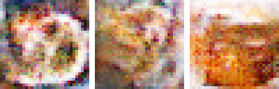
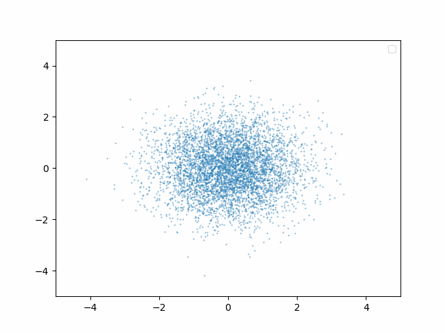
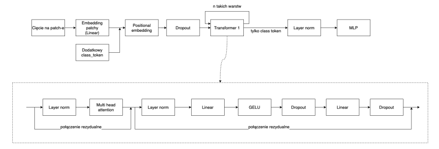

# Images processing

The aim of this repository is to get to know how images are being processed. It covers several topics, including:
- generating artificial images (using GAN and DDPM),
- image classification using visual transformer.

## [Generative Adversarial Network (GAN)](generative-adversarial-network/lab.ipynb)
By employing a dataset consisting of pumpkin cakes, we train both a generator and a discriminator model. The primary objective of the generator is to generate high-quality pumpkin cakes, while the discriminator aims to distinguish between real and fake ones. In order to expedite the training process, the images are downscaled to a resolution of 32x32 pixels.

**Results (upscaled)**




**GAN model structure**


## [Denoising Diffusion Probabilistic Models (DDPM)](denoising-diffusion-probabilistic-model/ddpm-denoising.ipynb)
The objective of this laboratory is to educate the PyTorch model on the task of denoising images. For this purpose, we emulate an image as a vector with a shape of `(2,)`. Initially, the model undergoes training using the `bicycle.txt` dataset. Subsequently, we employ the trained model to generate a denoised bicycle image by removing the noise introduced through a normal distribution.

**Bike generated from noise**


## [Image classification with Vision Transformers (ViT)](vision-transformer/lab.ipynb)
Image classification model using Vision Transformers.


### Other
```
jupyter nbconvert --to webpdf --allow-chromium-download lab.ipynb
```